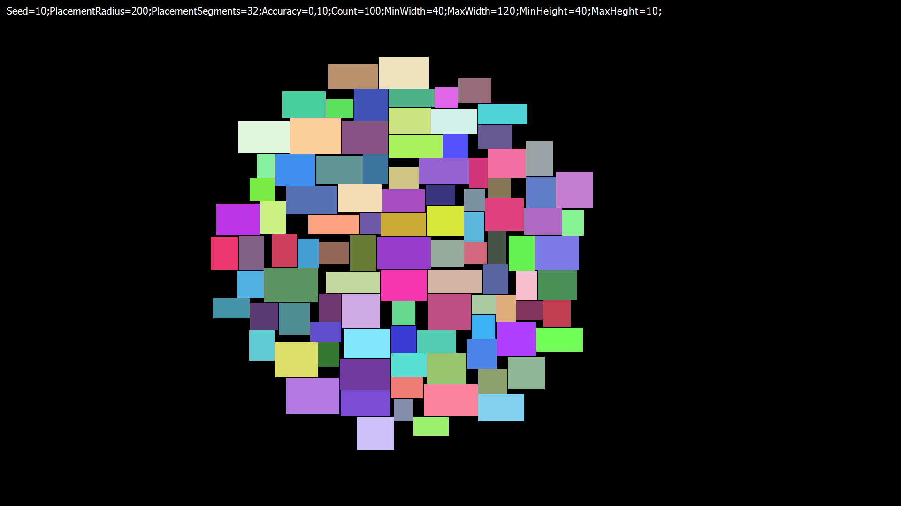
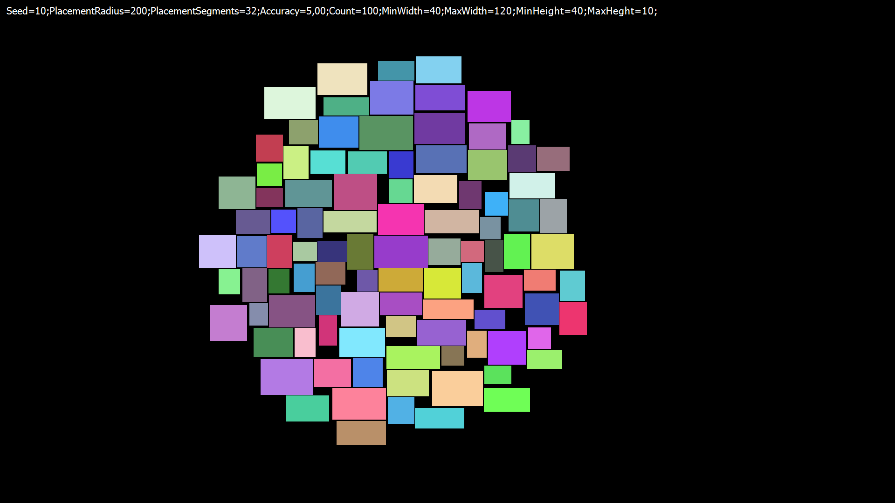
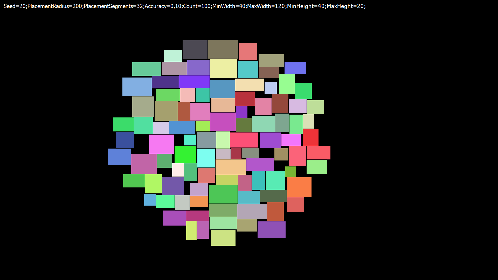

# Seed=10;PlacementRadius=200;PlacementSegments=32;Accuracy=0,10;Count=100;MinWidth=40;MaxWidth=120;MinHeight=40;MaxHeght=10;

# Seed=10;PlacementRadius=200;PlacementSegments=32;Accuracy=5,00;Count=100;MinWidth=40;MaxWidth=120;MinHeight=40;MaxHeght=10;

# Seed=10;PlacementRadius=200;PlacementSegments=32;Accuracy=50,00;Count=100;MinWidth=40;MaxWidth=120;MinHeight=40;MaxHeght=10;

# Seed=20;PlacementRadius=200;PlacementSegments=32;Accuracy=0,10;Count=100;MinWidth=40;MaxWidth=120;MinHeight=40;MaxHeght=20;

